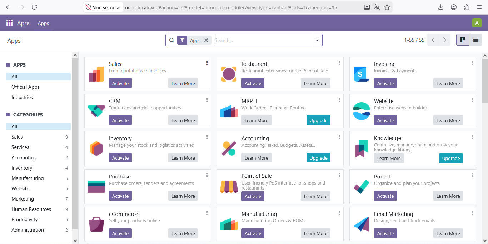
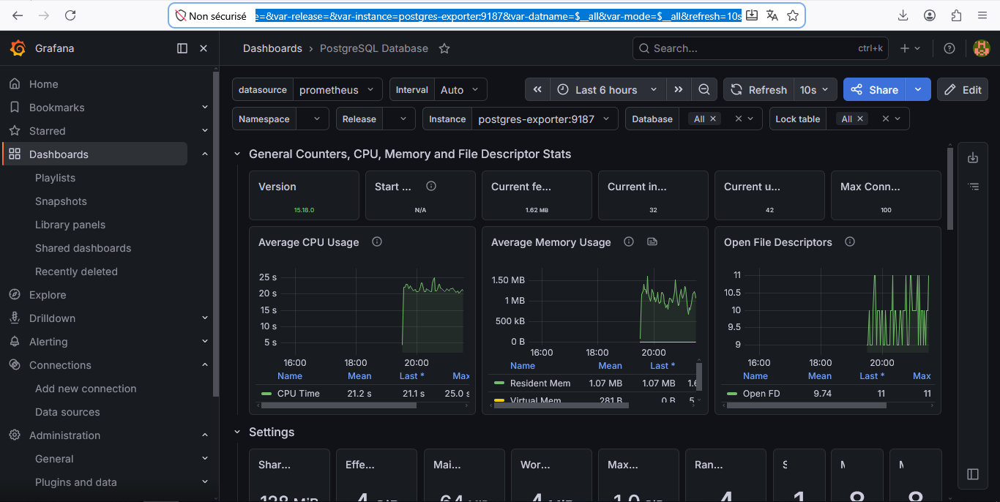
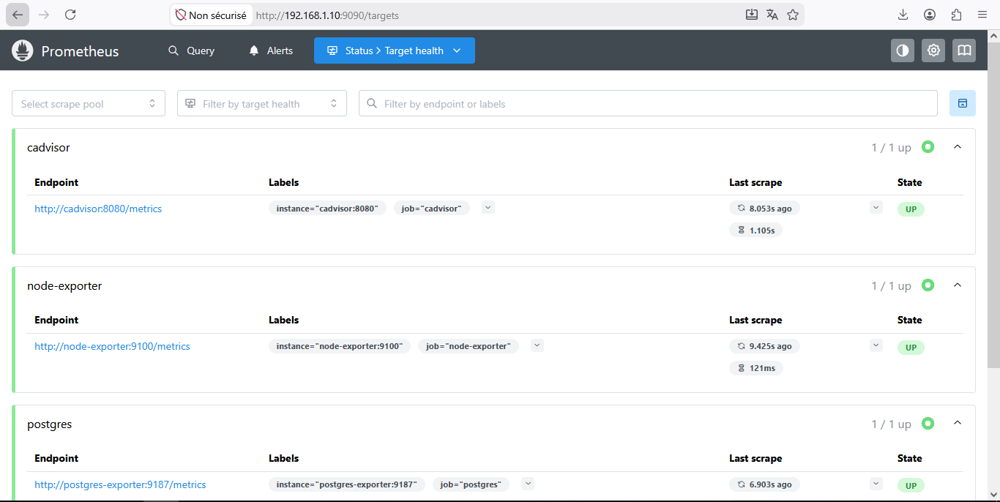
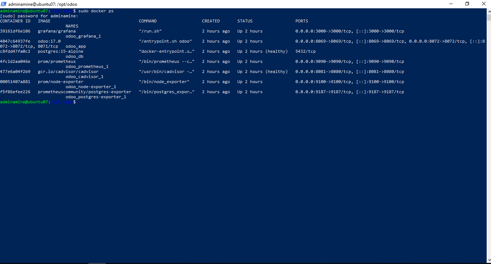

# 🚀 Odoo 17 Production-Ready Infrastructure


## 💼 Why this project exists
This project simulates a real enterprise ERP production environment used by small and medium-sized companies to ensure:
- Secure and scalable deployment
- System reliability and stability
- Infrastructure monitoring and observability
- Disaster recovery readiness
- Security hardening at infrastructure level

## 📈 Project Impact
This project demonstrates real-world DevOps and infrastructure engineering skills including deployment, security, monitoring, and automation in a production-like environment.

## 🎯 Project Overview
This project is a production-grade Odoo 17 ERP infrastructure deployed on a Ubuntu Server using Docker-based architecture.
It simulates a real-world enterprise environment by integrating:
- Secure reverse proxy (Nginx)
- Containerized ERP system (Odoo + PostgreSQL)
- Full monitoring stack (Prometheus + Grafana)
- Server security hardening (iptables + Fail2Ban)
- Automated backup and recovery system

👉 The goal is to demonstrate DevOps, System Administration, and Infrastructure Security skills in a real production-like setup.

## 👨‍💻 My Contributions
In this project, I personally:
- Designed and implemented the full infrastructure architecture
- Built a Dockerized Odoo production environment from scratch
- Configured secure reverse proxy using Nginx
- Implemented server hardening using iptables and Fail2Ban
- Deployed monitoring stack (Prometheus, Grafana, Node Exporter, cAdvisor)
- Automated backup and recovery system using cron jobs
- Structured the system for production-like deployment practices

## 💡 Project Goals
- Deploy a scalable and production-like ERP system
- Implement secure server architecture
- Automate infrastructure deployment using Docker
- Enable full system observability and monitoring
- Ensure data safety through automated backups

## 🏗️ Architecture

```
Internet
            │
            ▼
┌──────────────────────┐
│   Nginx (HTTPS 443)  │
└──────────────────────┘
            │
            ▼
┌──────────────────────┐
│     Odoo 17 App      │
└──────────────────────┘
            │
            ▼
┌──────────────────────┐
│  PostgreSQL Database  │
└──────────────────────┘
```

**Monitoring Stack:**

```
Node Exporter  ─┐
cAdvisor        ─┼──► Prometheus ───► Grafana Dashboard
Odoo Metrics    ─┘
```

## 🛠️ Tech Stack

| Layer | Technology |
|-------|------------|
| OS | Ubuntu Server 22.04 |
| Containerization | Docker + Docker Compose |
| ERP | Odoo 17 |
| Database | PostgreSQL 15 |
| Reverse Proxy | Nginx |
| Monitoring | Prometheus + Grafana + cAdvisor |
| Security | iptables + Fail2Ban |
| Automation | Bash + Cron |
| SSL | HTTPS (Self-signed for testing) |

## 🔒 Security Implementation
This project includes multiple security layers:
- 🔐 HTTPS encryption via SSL
- 🧱 Nginx reverse proxy hides internal services
- 🚫 iptables firewall restricts all unnecessary ports
- 🛡️ Fail2Ban protects against brute-force attacks
- 🔒 PostgreSQL is isolated in Docker network (no public exposure)
- 📦 Data persistence using Docker volumes
- 🔑 SSH access hardened and restricted

## 📊 Monitoring & Observability
The system is fully monitored using:
- **Grafana** → Visual dashboards
- **Prometheus** → Metrics collection
- **Node Exporter** → CPU, RAM, Disk monitoring
- **cAdvisor** → Docker container monitoring

## 💾 Backup & Recovery
- Automated daily backups using Cron jobs
- Includes:
  - PostgreSQL database
  - Odoo filestore
  - Configuration files
- Local backup system with extensibility to cloud storage

## 📸 Screenshots

### Production Odoo ERP Dashboard


### Grafana Monitoring Dashboard


### Prometheus Metrics Monitoring


### Docker Containers Status


## 🚀 Future Improvements
- [ ] Replace self-signed SSL with Let's Encrypt (production-ready domain)
- [ ] Add CI/CD pipeline using GitHub Actions
- [ ] Implement centralized logging (ELK stack)
- [ ] Add high availability (multi-node architecture)
- [ ] Integrate alerting system in Grafana

## 📌 Key Outcome
A fully functional production-like ERP infrastructure demonstrating:
- DevOps practices
- Linux system administration
- Cybersecurity fundamentals
- Infrastructure automation
- Monitoring and observability

## 🧑‍💻 Author

**Gheddab Mohamed Amine**

- 📍 Algeria 🇩🇿
- 🐙 GitHub: [github.com/MaminoMax](https://github.com/MaminoMax)
- 💼 LinkedIn: [linkedin.com/in/mohamed-amine-gheddab-0b9478252](https://linkedin.com/in/mohamed-amine-gheddab-0b9478252)

## ⭐ Support
If you found this project useful or interesting, please consider giving it a ⭐ on GitHub.
